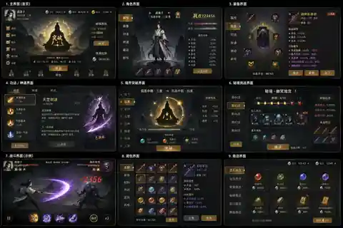
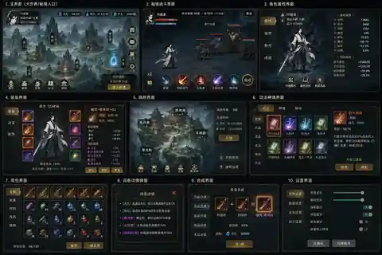
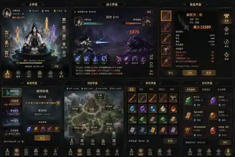
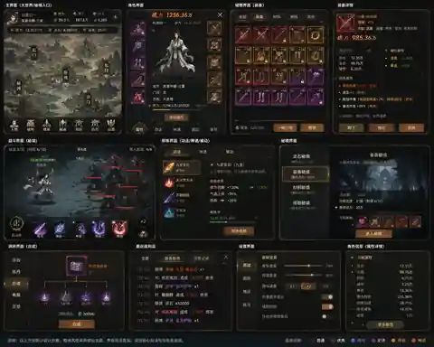
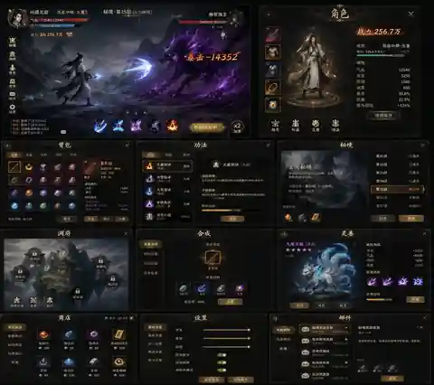
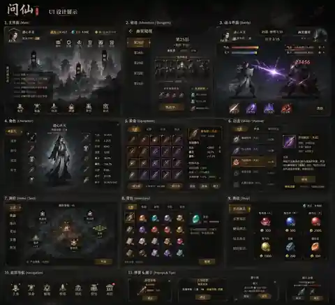
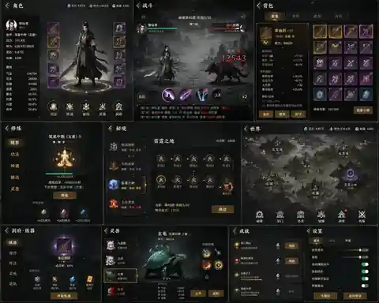

# UI 视觉参考图库

> 本文档收录本项目 UI 探索阶段生成的概念参考图。它们用于确定布局、层级、材质、色彩、战斗反馈和系统面板组织方式，不代表最终功能、数值或可直接照搬的界面文案。
>
> **边界说明**：图片中的大世界绘制仅作为视觉构图参考；实际移动系统继续使用纯格子、程序化地形与 Canvas 渲染，不恢复图片大地图。

## 使用方式

- **优先参考**：暗色墨韵背景、金色强调、稀有度色、面板边界、战斗反馈和信息层级。
- **需要改造**：图片中出现的手游化付费入口、过密功能、无对应系统按钮、伪数值和生成文字。
- **实现落点**：最终变量、尺寸、组件与交互仍以 [`ui-design.md`](ui-design.md) 和 [`../ui/prototype.html`](../ui/prototype.html) 为准。
- **数据约束**：所有按钮、属性、货币、装备、词条、秘境进度和战斗状态必须接入真实配置与 Store 状态，不允许将参考图中的占位内容直接写死。

## 参考图 01：全系统总览

可参考：首页突破主视觉、角色与装备、功法、境界突破、秘境、战斗、背包和商店的统一视觉语言。

## 参考图 02：世界与战斗

可参考：大世界入口的信息密度、横向战斗 HUD、洞府建筑层级、功法页与设置页的组织方式。

## 参考图 03：挂机成长布局

可参考：核心修炼入口、顶部资源栏、战斗日志、装备详情和底部主导航。

## 参考图 04：清晰信息层级

可参考：角色详情、仓储网格、装备属性拆分、设置页面和最近战利品记录。

## 参考图 05：首领与灵兽

可参考：首领战主画面、技能冷却、灵兽培养、邮件系统和秘境楼层列表。

## 参考图 06：完整界面矩阵

可参考：主界面、秘境、战斗、角色、装备、功法、洞府、背包、商店和弹窗之间的一致性。

## 参考图 07：角色与世界地图

可参考：装备环绕角色、世界区域层级、修炼、炼器、灵兽和成就页面。

## 设计提取结论

| 方向 | 落地建议 |
|---|---|
| 整体气质 | 保留暗色、墨韵和低饱和背景；金色只用于境界、重点 CTA 与稀有价值。 |
| 信息结构 | 主视野只保留一个当前主任务；复杂系统通过右侧面板、弹层或独立页面展开。 |
| 战斗反馈 | 强化血条、技能冷却、伤害数字、目标状态和战斗日志，但不得遮挡主要战斗视野。 |
| 装备与背包 | 统一稀有度边框、词条颜色、属性对比区、筛选与批量操作入口。 |
| 洞府与灵兽 | 使用场景化总览承载建筑和灵兽入口，再进入独立详情页处理升级、培养和资源消耗。 |
| 地图边界 | 概念图可参考构图与地标识别，不作为实际地图素材；运行时继续程序化生成。 |
| 文案与数值 | 生成图中的文案、数值与功能均为占位，落地前必须映射到真实配置、状态和机制闭环。 |
| 响应式布局 | 桌面端以 16:9 主视野为基准；窄屏优先折叠辅助面板，禁止压缩核心文字与战斗操作区。 |

## 推荐实施优先级

1. 先统一顶栏、底部导航、按钮、面板、标签页、进度条、物品格和词条颜色。
2. 再重构战斗、角色、装备、秘境、修炼五个高频界面。
3. 随后处理洞府、灵兽、合成、商店、邮件、成就和设置等低频界面。
4. 每个界面接入真实数据后，再追加动效、光效、粒子和过场，避免视觉先行导致机制脱节。
